## 🚀 Installation (développement)

1. Créer un environnement virtuel :
   python -m venv .venv
   .venv\Scripts\activate

2. Installer les dépendances :
   pip install pyqt6

3. Lancer l’application :
   python App.py

## 🛠️ Génération de l’exécutable (.exe)

Requiert PyInstaller :
   pip install pyinstaller

Puis exécuter :
   pyinstaller --onefile --windowed main.py

L’exécutable sera disponible dans le dossier dist/ :
   dist/main.exe

## 🗺️ Vue d'ensemble des fichiers

